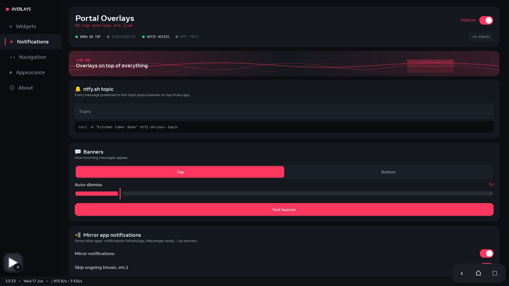

# Portal Overlays

A floating HUD for sideloaded Meta Portal devices. Draws widgets, banners, mirrored notifications, a live status strip, floating navigation, and a fullscreen Now Playing view on top of any app — no Google Play Services.


## Features

- **Push banners** from ntfy.sh (no Firebase / no FCM)
- **Mirrored notifications** from other apps as overlay banners
- **Draggable widgets**: clock, weather, battery, sticky note, Now Playing mini
- **Ticker overlay** from a real RSS, Atom, or JSON feed, shown along the top or bottom edge
- **Status strip** with time, date, weather, battery, ntfy state, live network speed, ISO week,
  rain-in-next-hour, sunrise/sunset countdown, streaming, VPN, and Wi-Fi indicators
- **Floating nav cluster**: Back, Home, Recents, Control Center swipe, Screenshot, Lock
- **Portal Mini app switcher fallback** when the Portal system has no Recents/Overview UI
- **Eight nav styles**: Pill segments, Underline indicator, Ghost pill, Floating squares, Dark glass,
  Icon + label, Colour-coded, and Dot indicator
- **Fullscreen Now Playing** with artwork, transport controls, animated visualizer, and a compact/expanded
  start preference
- **Customisation**: accent colour, opacity, corner radius, text scale, strip position, alert sounds

## Screenshots

| Widgets | Notifications | Navigation | Appearance | About |
|---|---|---|---|---|
|  |  |  |  |  |

## Requirements

- Meta Portal with ADB enabled
- Node.js 20+ (for `metavr`)
- JDK 17 + Android SDK (for building from source)

```bash
npx -y metavr device list   # confirm the Portal is connected
```

## Build & Install

```powershell
$env:JAVA_HOME='C:\Program Files\Android\Android Studio\jbr'
.\gradlew.bat assembleDebug
npx -y metavr app install -r app\build\outputs\apk\debug\app-debug.apk
npx -y metavr app launch com.portal.overlays
```

## Permissions

The Portal does not expose these through a normal settings UI, so grant them over ADB. Easiest path on Windows:

```powershell
.\enable_portal_permissions.bat
```

Or one by one:

```bash
# Draw over other apps
npx -y metavr adb shell appops set com.portal.overlays SYSTEM_ALERT_WINDOW allow

# Floating nav (Back/Home/Recents)
npx -y metavr adb shell settings put secure enabled_accessibility_services \
  com.portal.overlays/com.portal.overlays.NavAccessibilityService
npx -y metavr adb shell settings put secure accessibility_enabled 1

# Notification mirroring + media-session access
npx -y metavr adb shell cmd notification allow_listener \
  com.portal.overlays/com.portal.overlays.NotifyListenerService
```

> Portal's `AccessibilityServiceManager` only picks up `enabled_accessibility_services`
> after it has been initialised, and it wipes the setting on every boot. If
> `dumpsys accessibility` still shows `services:{}` after running the script
> above, **reboot the Portal and re-run the script once**:
>
> ```bash
> npx -y metavr adb reboot
> # wait for boot_completed=1, then:
> .\enable_portal_permissions.bat
> ```
>
> After that the service label `Overlays` will appear in `dumpsys accessibility`
> and the floating Back/Home/Recents cluster will start working.

Then open the app and turn on **Overlays running**.

## ntfy

Pick a long, unguessable topic name, then subscribe to it in the app's Notifications tab. Anything POSTed to `https://ntfy.sh/<topic>` becomes a banner:

```bash
curl -d "Kitchen timer done" https://ntfy.sh/your-topic
curl -H "Title: Doorbell" -H "Priority: high" \
     -d "Someone is at the door" https://ntfy.sh/your-topic
```

## Credits

Weather by [Open-Meteo](https://open-meteo.com). Push by [ntfy.sh](https://ntfy.sh). Made for the Portal sideloading community.

## License

MIT.
