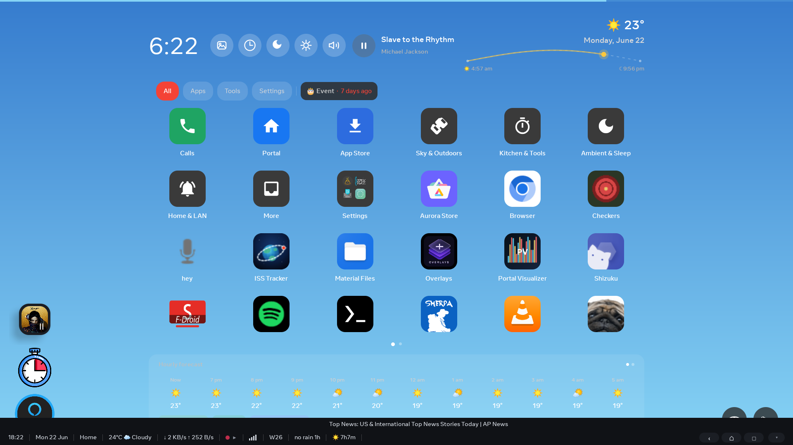
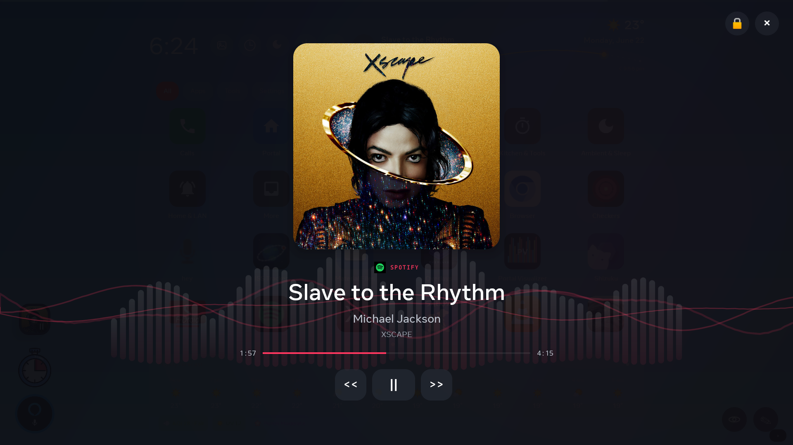
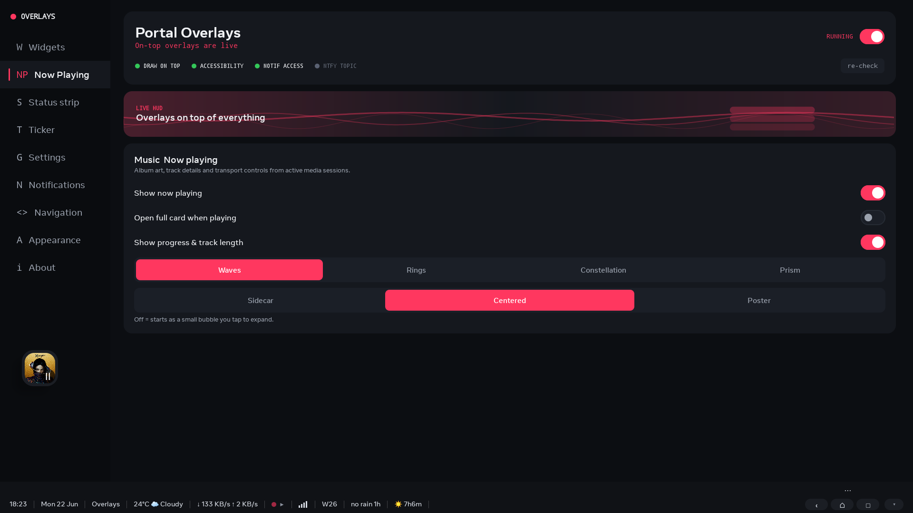
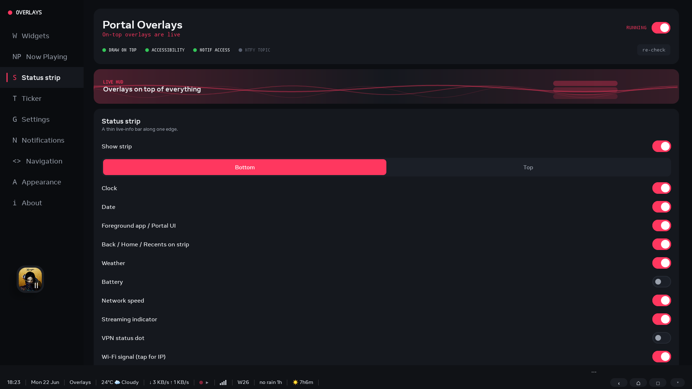
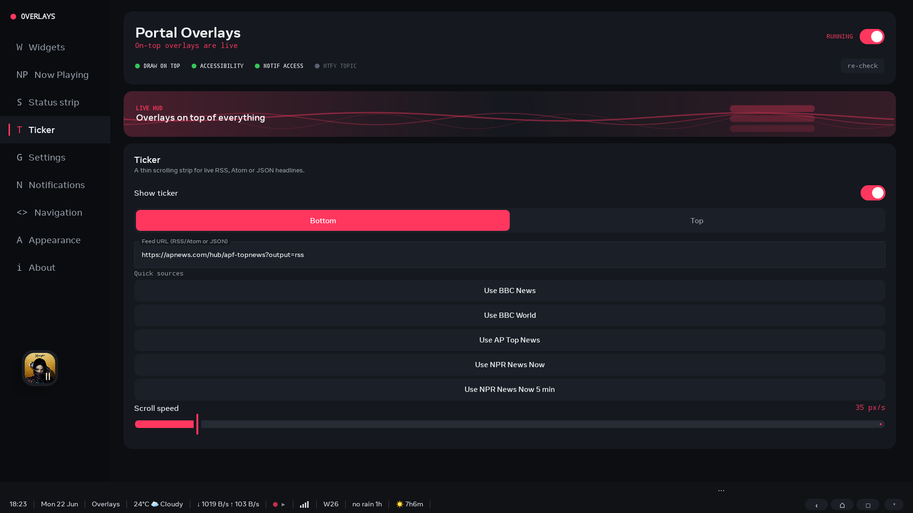
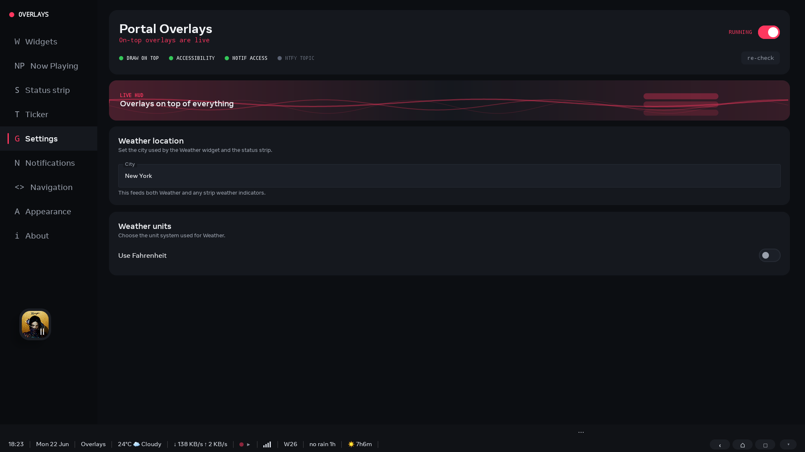
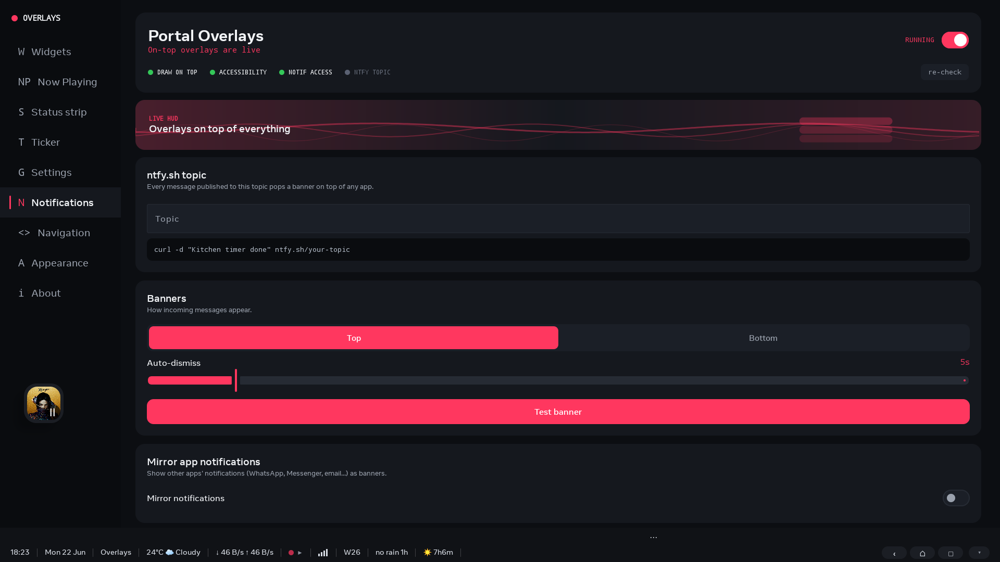
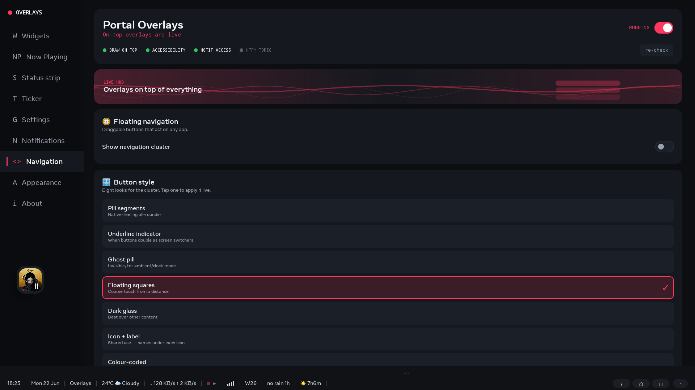
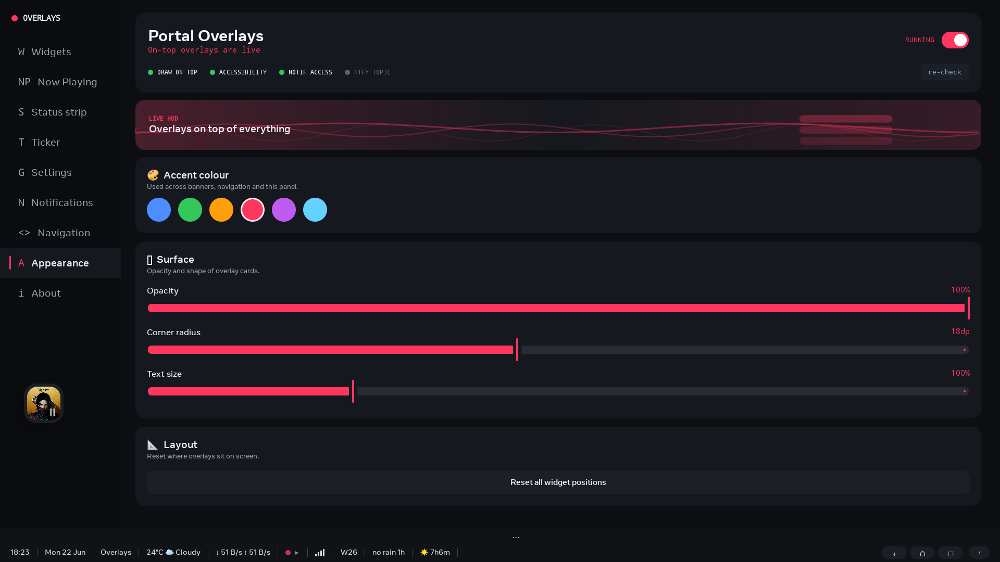
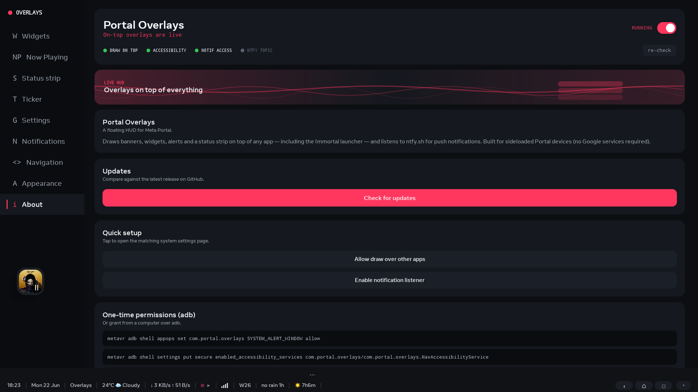

# Portal Overlays

A floating HUD for sideloaded Meta Portal devices. Draws widgets, banners, mirrored notifications, a live status strip, floating navigation, and a fullscreen Now Playing view on top of any app — no Google Play Services.



## Features

- **Push banners** from ntfy.sh — or your own self-hosted ntfy server (with optional access token) to keep messages private — no Firebase / no FCM
- **Mirrored notifications** from other apps as overlay banners
- **Draggable widgets**: clock, weather, battery, sticky note
- **Ticker overlay** from a real RSS, Atom, or JSON feed, shown along the top or bottom edge, with built-in live source presets (BBC, AP, NPR) plus live finance sources (crypto via CoinGecko, stocks via Stooq)
- **Status strip** with time, date, foreground app / Portal UI label, weather, battery, ntfy state,
  live network speed, ISO week, rain-in-next-hour, sunrise/sunset countdown, streaming, VPN, and
  Wi-Fi indicators, plus optional wider Back / Home / Recents buttons on the right
- **Floating nav cluster**: Back, Home, Recents, Control Center swipe, Screenshot, Lock
- **Portal Mini app switcher fallback** when the Portal system has no Recents/Overview UI
- **Eight nav styles**: Pill segments, Underline indicator, Ghost pill, Floating squares, Dark glass,
  Icon + label, Colour-coded, and Dot indicator
- **Now Playing dock shapes**: pick how the docked widget looks — a small cover-art **Bubble** (four
  styles: Rounded, Circle, Square, Minimal; three sizes), a floating **Strip** (cover art, title,
  artist, slim progress bar, play/pause), or a full-width **Edge bar** pinned to the top or bottom
  (source-app logo, mini equaliser, prev / play-pause / next, and elapsed / total time). All of them
  **auto-hide when nothing is playing** and reappear the moment audio starts, and tapping any opens
  the full card
- **Fullscreen Now Playing** with multiple background visualizers, multiple full-card layouts,
  transport controls, and a compact/expanded start preference — a **live progress bar with elapsed
  time and track length**, the **album name**, the **source-app logo** (e.g. Spotify), and a
  **screen-off button** next to the close control
- **Screensaver that survives the screen saver**: a built-in `DreamService` that re-hosts the Now
  Playing card (cover art, track / artist, the bouncing-bars equaliser), a large clock / date, and
  battery on the idle screen — so they stay on-screen while the screen saver is showing, which a
  floating overlay cannot (Android draws the saver on top of every app overlay). Choose the
  background — **Black**, a **Photo** you pick, or a **Web page** URL such as an Immich Kiosk feed
  (keeping your photo source behind the card) — on the new **Screensaver** tab, then set it as the
  device screensaver. See [Screensaver](#screensaver) below
- **Agenda / calendar widget**: a draggable card showing the next few events from a public iCalendar
  (`.ics` / webcal) feed, plus an optional next-event line on the status strip
- **Status strip styles**: 19 selectable looks for the strip (Dense Dark, Accented, Three Zones,
  Segments, Minimal Mono, Two Rows, Frosted Glass, Tinted Chips, Aurora, Daylight, HUD Tactical,
  Sunset, Ocean, Mono Graphite, OLED Black, E-ink Paper, Iconic, High Contrast, and a dynamic Sky),
  picked from a "Style" list on the Status strip page — each restyles the bar fill, text and accent
  colours, separators, and font
- **Status strip hide / restore**: a small chevron collapses the strip (and the ticker that rides
  with it) to a tiny handle so you can read what's underneath, then tap the handle to bring it back
- **Overlays auto re-arm**: reopening the app restores the overlays automatically — no toggling
  "running" off and on after the Portal kills the background service
- **Screenshot button** that saves to the gallery (Pictures/Screenshots) via MediaStore, with an
  app-storage fallback, instead of crashing on the Portal's Android 9
- **Dedicated control tabs** for Widgets, Now Playing, Status strip, Ticker, Settings, Notifications, Navigation, Appearance, and About
- **Settings page** for shared app-wide options like weather location and weather units, so they can be changed without enabling the Weather widget first
- **Status strip defaults** that start with the bottom strip enabled and the requested live items on:
  clock, date, foreground app, weather, network speed, Wi-Fi, week number, rain, sunset / sunrise,
  and optional strip-mounted Back / Home / Recents buttons
- **Startup defaults** with Clock off and Now Playing on, so a fresh install opens with the most
  useful media and strip overlays active
- **Customisation**: accent colour, opacity, corner radius, text scale, strip position, alert sounds,
  weather location, and weather units
- **Narrow update paths** so ticker changes restart only the ticker, while simple widget toggles do
  not tear down the entire overlay stack

## Screenshots

**Fullscreen Now Playing** — album art, source-app logo, album name, live progress / track length,
transport controls, plus screen-off and close:



| Widgets | Now Playing | Status strip | Ticker | Settings |
|---|---|---|---|---|
|  |  |  |  |  |

| Notifications | Navigation | Appearance | About |
|---|---|---|---|
|  |  |  |  |

## Requirements

- Meta Portal with ADB enabled
- Node.js 20+ (for `metavr`)
- JDK 17 + Android SDK (for building from source)

```bash
npx -y metavr device list   # confirm the Portal is connected
```

## Build & Install

```powershell
$env:JAVA_HOME='C:\Program Files\Android\Android Studio\jbr'
.\gradlew.bat assembleDebug
npx -y metavr app install -r app\build\outputs\apk\debug\app-debug.apk
npx -y metavr app launch com.portal.overlays
```

## Permissions

The Portal does not expose these through a normal settings UI, so grant them over ADB. Easiest path on Windows:

```powershell
.\enable_portal_permissions.bat
```

Or one by one:

```bash
# Draw over other apps
npx -y metavr adb shell appops set com.portal.overlays SYSTEM_ALERT_WINDOW allow

# Floating nav (Back/Home/Recents)
npx -y metavr adb shell settings put secure enabled_accessibility_services \
  com.portal.overlays/com.portal.overlays.NavAccessibilityService
npx -y metavr adb shell settings put secure accessibility_enabled 1

# Notification mirroring + media-session access
npx -y metavr adb shell cmd notification allow_listener \
  com.portal.overlays/com.portal.overlays.NotifyListenerService
```

> Portal's `AccessibilityServiceManager` only picks up `enabled_accessibility_services`
> after it has been initialised, and it wipes the setting on every boot. If
> `dumpsys accessibility` still shows `services:{}` after running the script
> above, **reboot the Portal and re-run the script once**:
>
> ```bash
> npx -y metavr adb reboot
> # wait for boot_completed=1, then:
> .\enable_portal_permissions.bat
> ```
>
> After that the service label `Overlays` will appear in `dumpsys accessibility`
> and the floating Back/Home/Recents cluster will start working.

Then open the app and turn on **Overlays running**.

## Screensaver

The floating overlays use `TYPE_APPLICATION_OVERLAY`, the highest window type a sideloaded app may
use — and Android composites a running screen saver / Daydream **on top of** it. So the now-playing
widget and status strip are hidden the instant the screen saver starts; nothing a floating overlay
does can paint over a screen saver. The only surface that survives one is the screen saver itself.

Portal Overlays therefore ships its own screen saver — a `DreamService` that re-hosts the content
people most want on the idle screen:

- the **Now Playing card** (cover art, track / artist, the bouncing-bars equaliser),
- a large **clock / date**, and a **battery** readout,

drawn over a background you choose on the **Screensaver** tab: **Black**, a **Photo** you pick, or a
**Web page** URL (e.g. an Immich Kiosk feed, so your photo source stays behind the card). The card
reads media sessions through the same notification-listener access the overlays use and only appears
while real audio is actually playing.

### Set it as the screen saver

The easiest way is the bundled helper — plug the Portal in (ADB enabled) and run, from a PC:

```bat
set_screensaver.bat
```

It auto-detects the Portal, registers this screen saver, allows the notification listener the
now-playing card needs, and (if the Immortal launcher is installed) stops Immortal from reclaiming the
slot. Switches:

- `set_screensaver.bat -Revert` — hand the screen saver back (re-enables Immortal if present)
- `set_screensaver.bat -KeepImmortal` — register without touching Immortal

You can also set it from the app's **Screensaver** tab ("Open screensaver settings"), or by hand:

```bash
adb shell settings put secure screensaver_components com.portal.overlays/.NowPlayingDreamService
adb shell settings put secure screensaver_enabled 1
```

### Running alongside the Immortal launcher

The Immortal launcher re-asserts its own screen saver on boot and on every return to its home screen,
which evicts any other screen saver. That self-healing is a no-op without `WRITE_SECURE_SETTINGS`, so
`set_screensaver.bat` revokes that from Immortal for you (undo with `-Revert`). By hand:

```bash
adb shell pm revoke com.immortal.launcher android.permission.WRITE_SECURE_SETTINGS
adb shell settings put secure screensaver_components com.portal.overlays/.NowPlayingDreamService
adb shell settings put secure screensaver_enabled 1
```

To keep your Immich Kiosk feed, set the Screensaver background to **Web page** and paste the same
Kiosk URL — you get the photo feed *and* the bouncing-bars now-playing on top, both surviving the
screen saver.

The visualizer animates whenever music is playing. A **React to live audio** option exists but is
experimental and off by default — true audio reaction isn't achievable on Portal for a sideloaded app
(the output mix is permission-locked and the mic is preempted by the always-on assistant). See
[`docs/portal-audio-capture.md`](docs/portal-audio-capture.md).

## ntfy

Pick a long, unguessable topic name, then subscribe to it in the app's Notifications tab. Anything POSTed to `https://ntfy.sh/<topic>` becomes a banner:

```bash
curl -d "Kitchen timer done" https://ntfy.sh/your-topic
curl -H "Title: Doorbell" -H "Priority: high" \
     -d "Someone is at the door" https://ntfy.sh/your-topic
```

### Self-hosted ntfy

To keep messages off the public server, run your own [ntfy](https://docs.ntfy.sh/install/) instance and set the **Server URL** on the Notifications tab (e.g. `https://ntfy.example.com`, or a plain `http://` LAN address). For a read-protected/private topic, generate an access token (`ntfy token add <user>`) and paste it into the **Access token** field — it's sent as a Bearer token. Then publish to your own server:

```bash
curl -H "Authorization: Bearer tk_yourtoken" \
     -d "Private message" https://ntfy.example.com/your-topic
```

## Credits

Weather by [Open-Meteo](https://open-meteo.com). Push by [ntfy.sh](https://ntfy.sh). Made for the Portal sideloading community.

## License

MIT.
