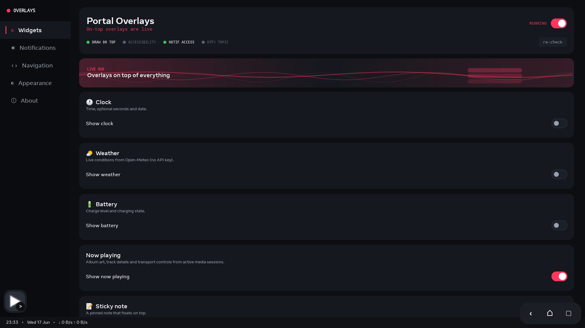
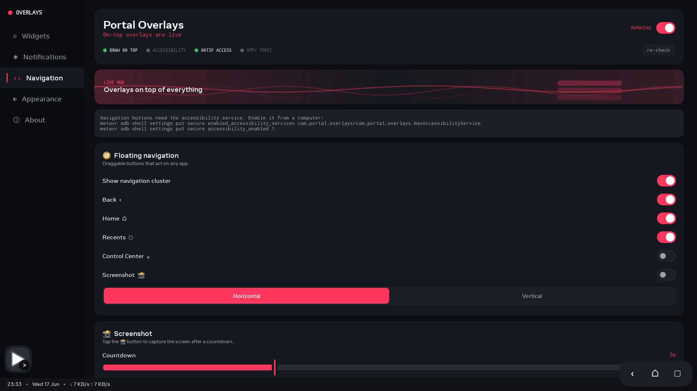
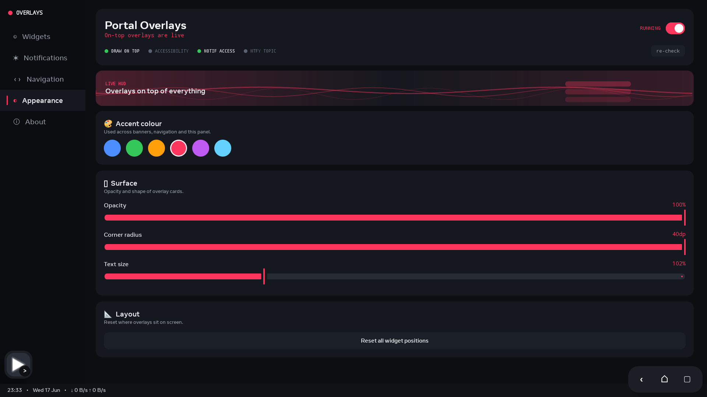
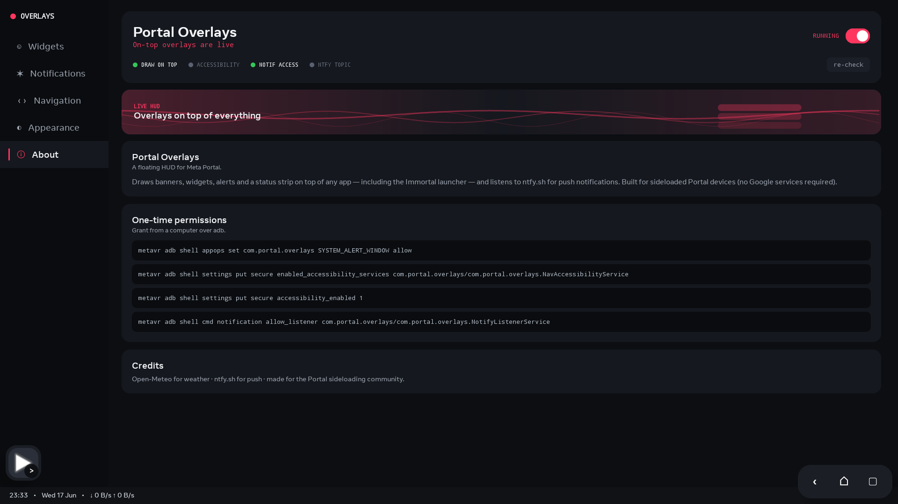
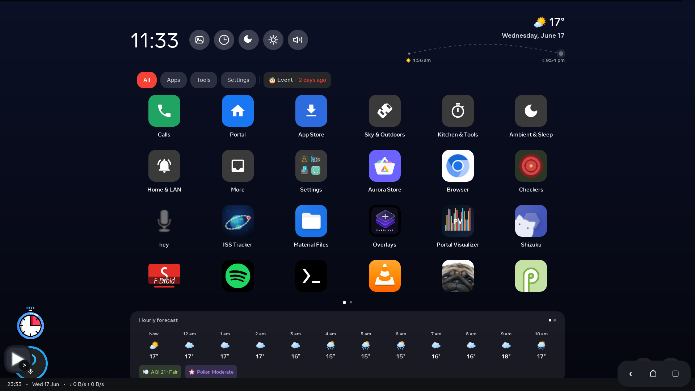

# Portal Overlays v1.0

First public release. A floating HUD for sideloaded Meta Portal devices — widgets, push banners, mirrored notifications, status strip, floating nav, fullscreen Now Playing. No Google Play Services required.

## What's in this release

- **On-top widgets**: clock, weather (Open-Meteo), battery, sticky note, Now Playing mini
- **Push banners** from ntfy.sh
- **Notification mirroring** (Android `NotificationListenerService`)
- **Floating nav cluster** via `AccessibilityService` (Back / Home / Recents / Control Center swipe / Screenshot)
- **Status strip** with time, date, weather, battery, ntfy state, live network up/down
- **Fullscreen Now Playing** with artwork, transport controls, animated visualizer
- **Customisation**: accent colour, opacity, corner radius, text scale, strip position, saved widget positions

## Screenshots

| | | |
|---|---|---|
|  |  |  |
| Widgets | Notifications | Navigation |
|  |  |  |
| Appearance | About | On the Immortal launcher |

## Install

```bash
npx -y metavr app install -r PortalOverlays-v1.0-release.apk
npx -y metavr app launch com.portal.overlays
```

## Permissions

Grant once over ADB (easiest: run `enable_portal_permissions.bat` from the source repo, or see the README).

## License

MIT.
